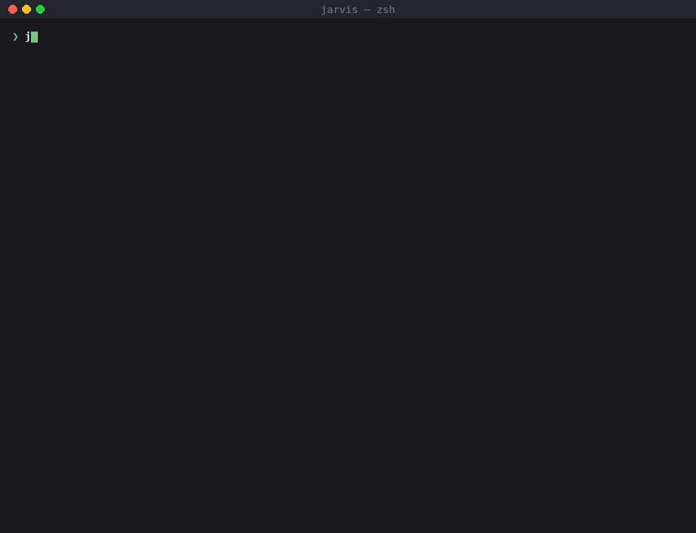

# Участие человека (ADR-0019)

Человек нужен в четырёх местах, и каждое — тред (`interactions`) с сообщениями, состоянием и тем, что
run ждёт (`waitingFor`): **approval** (гейт), **clarification** (вопрос агента), **review**
(замечания к коду), **conflict** (расхождение ручных правок). `jarvis threads` показывает открытые.

Кроме тредов run ждёт решения ещё в двух случаях, оба — без треда:
- **бюджет** (`waitingFor: budget`): кончился `budget.perRun|perStep` или лимит вызовов агента при `onLimit: ask`.
  Решение — добавить (`enter` — половину лимита, `m` — другое число) или закончить шаг с тем, что есть (`f`,
  результат помечается неполным);
- **исчерпанная петля** (`waitingFor: loop`): поправить рабочую копию руками (`o` — открыть в редакторе, `s` —
  шелл там) и `r` — запустить шаг снова; на странице ещё **One more round of <шаг>** — ещё круг шага, куда вело
  ребро (implementation с причинами и заметками), потом снова проверка.

## Карточка и страница

Run, остановившийся в терминале, показывает карточку решения: на гейте `enter` — прочитать документ целиком, `a` —
принять, `c` / `e` — вернуть с правками (здесь же или в `$EDITOR`), `o` — открыть рабочую копию в редакторе, `q` —
решить позже, `?` — справка. Отклонения в карточке нет — это `jarvis approve --reject`. `jarvis continue` (`c`)
возвращает к карточке.

То же решение можно принять на странице `jarvis ui` — той же функцией и с тем же актором. На одну версию — одно
решение: второе отклоняется, а карточка, которая ждёт в терминале, видит решение со страницы и идёт дальше. Если
карточки нет, run продолжает страница ([ADR-0023](adr/0023-editor-and-web-ui.md) §4, §6).

На странице, кроме того ([cli.md](cli.md), раздел `jarvis ui`):
- **открытые вопросы документа** — форма над решением: у каждого вопроса ответ Jarvis из источников с тем, где он
  стоит, варианты, свой ответ, «спросить аналитика», «не в скоупе» (`human.suggestAnswers`); ответы уходят с Send
  back и записываются артефактом `answers`;
- **комментарий к Accept** обязателен для всех следующих шагов, как и ответы;
- **Send back видно в круге доработки**: «Fixing what <кто> sent back at <гейт>» с комментарием целиком;
- **заметка агенту на ходу** (`✎ Add a note`) — обязательна для текущего агента со следующего вызова модели и для
  всех шагов после;
- **Try it before you decide** на гейте реализации — рабочая копия, запуск (`workspace.try`), критерии приёмки
  списком, что сделают Accept и Send back;
- **Pause** — прогон встаёт в безопасной точке с сохранённым местом, Resume продолжает.

## Гейты

Шаг `approval` ждёт решения по последней версии артефакта типа `artifactType`. Решение привязано к
точному хешу содержимого: новая версия артефакта — новое решение.

```sh
jarvis approve <run> --resume                        # утвердить и продолжить
jarvis approve <run> --request-changes --comment "…" # назад по объявленному ребру
jarvis approve <run> --reject --comment "…"          # run → FAILED
jarvis approve <run> --commit                        # + .jarvis/approvals/<task>/<type>.json для CI
```

`human.gates.<type>.required: false` проходит гейт молча с событием `approval.skipped`.



## Уточнения

Агент `requirements` (и `review-analysis`) может ответить `needs_clarification` с одним вопросом и
рассмотренными интерпретациями. Run паркуется в `WAITING_HUMAN`, открывается тред.

Два способа ответить:

- **асинхронно** — `jarvis answer <thread|run> "текст"`: агент-кларификатор (`generateStructured`,
  схема `ClarifierTurn`) задаёт следующий вопрос или предлагает правило; `--accept` принимает
  предложение, `--rule "…"` — свою формулировку, `--reject` закрывает тред без решения; `--resume`
  продолжает run;
- **на странице прогона** — карточка с вопросом, интерпретациями и полем ответа; правило, уже решённое в другом
  прогоне той же задачи, предлагается сверху («Accept this rule and go on»);
- **в живую** — `jarvis attach <run>`: тот же тред как мини-чат в терминале (`a` принять, `e <rule>`
  принять со своей формулировкой, `r` отклонить, `q` выйти); после решения run возобновляется.

Решение становится артефактом `clarification`; все последующие агенты видят его в L2 как обязательное
(«принято с человеком, не спрашивать снова»), транскрипт остаётся в треде. `human.clarification.maxTurns`
ограничивает диалог, `multiTurn: false` — один вопрос, один ответ.


## Review Mode

Финальный гейт `approve-impl` — на реализации. Вместо утверждения можно оставить замечания прямо в коде
worktree (`jarvis status <run>` печатает путь):

```ts
// REVIEW: the status check belongs in the domain layer, not here
export function canRestartOnboarding(status: string) { … }
```

```sh
jarvis review submit <run> --resume
```

1. Маркеры собираются, в код записываются идентификаторы `REVIEW(R-1):`, создаётся артефакт
   `review-package` (файл, строка, текст, контекст).
2. Гейт отправляется по ребру `review_submitted` к агенту `review-analysis`, который классифицирует
   каждое замечание: `CODE` (исправить), `SPEC_CORRECTION` (назад к spec), `REQUIREMENT_CORRECTION`
   (назад к requirements), `QUESTION` (тред уточнения), `KNOWLEDGE_CANDIDATE` (кандидат в
   стандарт/знание), `SUGGESTION` (к сведению) — и выбирает исход графа.
3. После исправлений run снова на `approve-impl`; маркеры удаляются при `jarvis apply`
   (`human.review.removeMarkersAfterApproval`).

Каждое замечание проживает жизненный цикл, видимый в `jarvis review status <run>`:

```
open ──analysis──▶ acknowledged ──implementation──▶ applied ──gate──▶ ready_for_review ──approve──▶ resolved
  └─ SUGGESTION / KNOWLEDGE_CANDIDATE ──▶ resolved сразу
```

Повторный `review submit` сохраняет состояние и историю замечаний с тем же id и неизменённым текстом;
изменённый текст — новое замечание. `human.review.sourceMarkers: false` отключает режим.


## Ручные правки в worktree

Пока run ждёт, можно править файлы в его worktree. При `jarvis resume` они фиксируются как checkpoint
`human edit` (`Jarvis-Kind: human-edit`) — не сбрасываются, попадают в diff и к агентам. Правка
артефакта (spec и др.) — новая версия с unified diff и provenance «human». Правки фиксируются всегда:
отключать это нельзя.

## Что видит человек

- `jarvis status <run>` — что ждёт run, уровень проекта, шаги с итерациями, артефакты с версиями и
  утверждениями, эффекты, события, токены; `--watch` сам останавливается на гейте.
- `jarvis threads`, `jarvis review status`, `jarvis candidates list`.
- Markdown-сводка и `approval-request.json` в CI (см. [ci.md](ci.md)).
