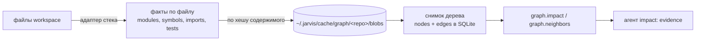

# Знание проекта: стандарты, навыки, документы, поиск, граф

Jarvis не угадывает, как принято в проекте — он читает это из `.jarvis/` и подаёт агентам
детерминированно (ADR-0020), ищет по индексу с глоссарием (ADR-0015) и считает влияние по графу
кода (ADR-0008, ADR-0021).

## Три вида явного знания

| Вид | Где | Что | Проверяется |
|---|---|---|---|
| Стандарт | `.jarvis/standards/<id>.md` | правило с областью и severity | детерминированно (`standards.check`), семантически (ревью) или оба |
| Навык | `.jarvis/skills/<id>/{skill.yaml,instructions.md}` | как делать класс изменений | через `verification` (возможности, которые должны пройти) |
| Документ | `.jarvis/knowledge/*.md` | факты: архитектура, домен, соглашения | — |

Личные дополнения в `~/.jarvis/standards/`, `~/.jarvis/skills/` видны только их владельцу и не могут быть
`required`. Проектный навык с тем же `id`, что у встроенного (`sdd-implementation`, `unit-testing`,
`refactor`), заменяет его.

### Стандарт

```markdown
---
id: no-console
version: 1
title: No console output in library code
scope: { paths: ["src/**"], stacks: [typescript] }
severity: required            # required | recommended
verification:
  kind: deterministic         # deterministic | semantic | hybrid
  check:
    pattern: { glob: "src/**/*.ts", mustNot: 'console\.log' }   # или must: '…'
    # либо tool: project.lint  (возможность, успех которой = проверка; args: {…})
source: { kind: confluence, ref: CONF-1234 }
tags: [logging]
---
Library code writes through the logger, never to the console.
```

`required` + детерминированная проверка: нарушение в `verify` возвращает `implementation` с исходом
`standards_violation`, нарушения — в loop reasons. Семантические стандарты попадают в контекст агента
ревью, который отчитывается `standardsChecked`. `jarvis standards list|check`.

### Навык

```yaml
# .jarvis/skills/react-component-change/skill.yaml
id: react-component-change
version: 1
title: Change a React component
appliesTo:
  stacks: [react]
  paths: ["src/**/components/**"]
  kinds: [feature, change]          # feature | change | fix | refactor | test | docs; пусто = любой
  agents: [implementation]          # пусто = implementation
requiredCapabilities: [project.tests]
requiredStandards: ["STD-REACT-*"]  # glob по id; подтягиваются в пакет вместе с навыком
verification: [project.tests, project.lint]
inputs: [spec, plan]
outputs: [implementation]
```

`instructions.md` рядом — текст для агента. Навык с `IMPROVEMENT.md` в своей папке показывает
предложение по улучшению, ожидающее человека.

### Документ знания

```markdown
---
tags: [orders]
paths: ["src/orders/**"]
stacks: [typescript]
agents: [research, specification]
---
# Orders
…
```

Без front matter документ подходит любой задаче. Заголовки `#`/`##` делят документ на единицы индекса.

### Глоссарий

`.jarvis/knowledge/glossary.md` — таблица, не документ для агентов:

```markdown
| термин | синонимы | символы/модули | источники | обновлено |
|---|---|---|---|---|
| повторная регистрация | restart onboarding, re-register | canRestartOnboarding, OnboardingService | CONF-12 | 2026-10-01 |
| заявка | application | Application, applications/ | | |
```

Необязательная шестая колонка `определение` — что термин значит; её выводит `jarvis ask <термин>`.

Запрос «повторная регистрация заявки после отказа» расширяется до `restart onboarding`,
`canRestartOnboarding`, `application`, `applications/` — детерминированно, с учётом словоформ (основа
термина), и каждое расширение попадает в трассу результата.

### Первичное наполнение: `jarvis onboard`

Для существующего репозитория `jarvis onboard` собирает факты (модули и их зависимости из графа,
документация, тесты, стиль коммитов) и пишет `architecture.md` и `conventions.md` с front matter
`tags: [architecture, generated]` / `[conventions, generated]` и маркером регенерации. Это заготовки только с
проверяемыми фактами; смысл модулей и правила добавляет человек или `jarvis onboard --module <path>`: агент
описывает один модуль с evidence, проверка сверяет цитаты с кодом, результат — кандидат со `paths` на `promote`. Подробности —
[cli.md](cli.md#jarvis-onboard---dry-run---refresh---apply-config---no-graph).

### Документация команды на месте: `knowledge.sources`

Если команда уже держит документацию и инструкции агентам в репозитории (`documentation/`, `AGENTS.md`),
их не нужно копировать в `.jarvis/`: `knowledge.sources` в `project.yaml` читает их на месте, один источник
правды остаётся у команды. Markdown под `path` становится знанием с именем-путём
(`knowledge:documentation/billing/overview.md`), документы по `skills` — скиллами, `scopes` привязывает часть
документации к путям кода (документ вне `scopes` относится ко всему), `AGENTS.md` ниже корня относится к своему
каталогу. Пути из `security.deniedPaths` не читаются. Индекс, `knowledge.read`/`knowledge.search`, `jarvis ask`
и `jarvis mcp serve` видят источники так же, как `.jarvis/knowledge`. `onboard --module` задаёт run область
(артефакт `scope`), поэтому агент получает документацию своего модуля, а не всю.

Зачем: в пилоте агент онбординга по одному коду нашёл механику одного модуля, но почти ни одного правила
использования и ловушки — они были только в документации команды.

## Пакет контекста (EngineeringContextPackage)

На каждый вызов агента резолвер (`src/knowledge/resolver.ts`) собирает пакет по области задачи — стеки
(из `stack`, `stackScopes` или детекции по затронутым путям), пути из impact/plan, вид задачи, id агента:

1. **Навыки** — все подходящие, отсортированные по специфичности (сколько осей области совпало),
   первые `knowledge.maxSkills` целиком, остальные — ссылками «доступно по запросу».
2. **Стандарты** — подходящие по области плюс `requiredStandards` выбранных навыков.
3. **Документы** — подходящие по front matter; если их больше `knowledge.retrieval.rankAbove`, порядок
   задаёт индекс по запросу из задачи и требований (событие `retrieval.knowledge`), ничего не
   отбрасывается — не влезшее становится ссылкой.

Пакет рендерится слоем L4 с долями бюджета `knowledge.split`. Ссылки читаются агентом через
`knowledge.read` (`knowledge:name`, `standard:ID@v`, `skill:id@v`, `artifactId@v`) и записываются в
provenance артефакта. `jarvis mcp serve` → `context.inspect` показывает точный пакет для задачи.

## Поиск (ADR-0015)

Индекс в SQLite (миграция 0004): единицы — секции документов, стандарты, навыки, артефакты run
(research, requirements, spec, impact, plan, review, clarification, release-notes). Каждая единица
версионируется хешем содержимого: переиндексируется только изменившееся, удалённое вычищается.

- **Лексический** индекс — FTS5 с bm25, всегда.
- **Семантический** — векторы через `Embedder` (OpenAI-совместимый `/embeddings`, модель из
  `knowledge.retrieval.embeddings`), ключ `(единица, версия, embedder)`: другой embedder — другой индекс.
  Выключен по умолчанию до прохождения гейта ADR-0015 §6.
- **Слияние** — Reciprocal Rank Fusion (k = 60); у каждого результата `retrievalPath`
  (`[{index: lexical, rank: 1}, {index: semantic, rank: 3}]`).

Агентам доступны `knowledge.search` и `knowledge.read`; человеку — `jarvis knowledge index|search` и справочник
`jarvis ask` (термины из глоссария, ответ по базе с проверенными цитатами);
IDE — `knowledge.search` через MCP.

## Граф проекта (ADR-0008, ADR-0021)



- Факты извлекаются по файлу и кэшируются по его хешу — общие для всех веток и worktree; снимок
  строится на дерево git; хранятся последние 5.
- Шаг `discover` перед агентами сам приводит граф в порядок для дерева run (из кэша это быстро; событие
  `graph.update` с `trigger: discover`), а идентификатор репозитория для worktree совпадает с основным
  checkout, поэтому снимок проекта виден из worktree run.
- `jarvis knowledge update` — инкрементально; `--full` без кэша. `jarvis knowledge status --verify`
  пересчитывает и сравнивает: граф детерминирован или тест падает.
- Агент `impact` использует `graph.impact(paths)` и `graph.neighbors(symbol)` как доказательства и явно
  говорит, когда снимка нет.
- Импорты разрешаются на уровне дерева: относительные — ядром, остальное — резолвером адаптера. TS-адаптер
  берёт `paths`/`baseUrl` ближайшего к файлу `tsconfig.json` (с `extends`, комментариями) и пакеты
  workspace-монорепо (`workspaces` корневого `package.json`): `@acme/lib/billing` через `exports` пакета
  (`./*` → `./.publish/*.js`) отображается обратно в `packages/lib/src/billing/index.ts`. Внешние пакеты
  остаются узлами `pkg:<имя>`. Без этого правка библиотеки не находила затронутые приложения.

### Уровни возможностей

Первый шаг `sdd` — `discover` — пишет артефакт `project-capabilities`: стеки (заданные и
обнаруженные), области полиглот-репозитория, адаптеры, эффективные команды (`tests`, `typecheck`,
`lint` — из `tools.local` или адаптера), откуда каждая возможность, и уровень:

| Уровень | Условие | Следствие |
|---|---|---|
| FULL | адаптер языка: граф + code intelligence + диагностика | impact по графу, точные проверки |
| BASIC | нет адаптера, но есть команды проекта | работает на тексте и `project.*` |
| UNSUPPORTED | нет ни адаптера, ни команд | run останавливается с `policy:` причиной |

Адаптеры: TypeScript (`src/adapters/typescript`, ts-morph). Остальные стеки — BASIC. Как добавить —
[extending.md](extending.md#адаптер-языка).

## Кандидаты в знание (ADR-0020 §6)

Агенты `review` и `review-analysis` предлагают `candidates` — правило, которое стоило бы
зафиксировать как стандарт или документ. Они хранятся артефактами `candidate` и ждут человека:
`jarvis candidates list`, `promote <id> [--id file-id]` (пишет файл в `.jarvis/standards/` или
`.jarvis/knowledge/` и фиксирует решение), `reject <id>`. `human.review.knowledgePromotion: never`
выключает предложения.
