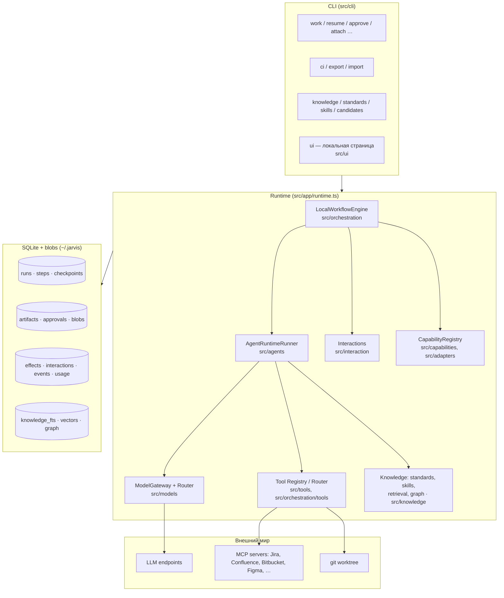

# Обзор архитектуры

Jarvis — локальный (на машине разработчика или в CI) движок, который проводит задачу через
спецификационный процесс: исследование → требования → спецификация → утверждение → анализ влияния → план
→ реализация → проверка → ревью → утверждение → release notes. Каждый шаг — либо агент (LLM с
ограниченным набором инструментов), либо детерминированная проверка, либо человеческий гейт. Всё, что
происходит, записывается в SQLite и переживает падение процесса, ожидание квоты и ручное возобновление.

Решения зафиксированы в [ADR](adr/); здесь — карта того, как они собраны в код.

## Слои



| Слой | Что делает | Где |
|---|---|---|
| Domain | Run, состояния, актор, артефакты, контракты возможностей; без зависимостей от стека | `src/core` |
| Storage | схема и миграции, RunStore, ArtifactStore/BlobStore, checkpoints, журнал эффектов | `src/storage`, `src/artifacts` |
| Models | адаптеры провайдеров, роутер по ролям, пулы квот (безлимитные часы, переход на следующую модель роли), кассеты, структурный вывод | `src/models`, `src/budget` |
| Orchestration | движок workflow, исполнители шагов, worktree, аренда | `src/orchestration` |
| Agents | определения агентов, слоистый контекст, цикл вызова инструментов | `src/agents` |
| Tools | локальные инструменты, MCP-клиент и профили, политика, редактирование секретов | `src/tools`, `src/mcp`, `src/security` |
| Knowledge | стандарты, навыки, знание, глоссарий, индекс, граф проекта | `src/knowledge` |
| Capabilities | детекция стеков, уровни поддержки, адаптеры языков | `src/capabilities`, `src/adapters` |
| Interaction | треды с человеком: approval, clarification, review, conflict | `src/interaction` |
| Onboarding | скан репозитория, дерево модулей, исследование модуля агентом | `src/onboarding` |
| Design | задача, её страницы и макеты Figma, прочитанные кодом без модели | `src/design` |
| Hooks | проверки перед `git push` | `src/hooks` |
| App / CLI | сборка runtime, команды, вывод | `src/app`, `src/cli` |
| Web UI | `jarvis ui`: прогоны, решения, New task, база знаний | `src/ui` |

Архитектурный тест `tests/architecture/stackNeutral.test.ts` не даёт ядру упоминать конкретные стеки или
импортировать адаптеры (ADR-0021).

## Ключевые понятия

**Run** — одно прохождение задачи по workflow. Состояния (ADR-0001 §4, ADR-0002 §6):

```
CREATED → RUNNING → COMPLETED
             ├→ WAITING_BUDGET → RUNNING          (квота или модель недоступна; resumeAfter)
             ├→ WAITING_HUMAN  → RUNNING | FAILED  (гейт, тред, неразрешённый эффект, бюджет, петля)
             ├→ SUSPENDED      → RUNNING
             ├→ FAILED         → RUNNING (повтор)
             └→ CANCELLED
```

Run держит *аренду* с эпохой (ADR-0002 §5): один процесс исполняет run, heartbeat продлевает аренду,
`jarvis resume --steal` забирает её у мёртвого процесса и фиксирует это в журнале событий.

**Workflow** — граф шагов в YAML (ADR-0004): виды `deterministic` (инструмент), `agentic` (агент),
`approval` (гейт по типу артефакта), `composite` (параллельные дети с общим бюджетом). Переходы —
чистая функция от результата шага; обратные рёбра объявлены явно с `maxIterations`. Checkpoint на каждой
границе шага. См. [workflows.md](workflows.md).

**Artifact** — неизменяемая версия документа (spec, plan, implementation, review, …) с provenance:
кто (агент/человек/инструмент), из каких входов, с каким контекстным пакетом. Человеческая правка —
новая версия с unified diff; approval привязан к точному хешу содержимого (ADR-0005).

**Effect** — внешнее действие (комментарий в Jira, `git push`, PR). Проходит через журнал
*intended → done* с проверкой через тот же сервер после resume, чтобы ничего не выполнилось дважды
(ADR-0002 §2–4).

**Interaction** — тред с человеком: approval, clarification, review, conflict. У парковавшегося run
есть `waitingFor` — что именно он ждёт. См. [human.md](human.md).

**EngineeringContextPackage** — что агент получает от проекта на каждом вызове: навыки, стандарты,
знание — выбранные по стеку, путям и виду задачи, уложенные в бюджет (ADR-0020). См.
[knowledge.md](knowledge.md).

**Capability level** — FULL / BASIC / UNSUPPORTED для проекта: есть ли адаптер языка, граф, тесты и
проверки. Записывается артефактом `project-capabilities` первым шагом `sdd` (ADR-0021).

## Один run от начала до конца

1. `jarvis work ABC-42` — preflight (модели, MCP-серверы, которые нужны агентам workflow), создание run,
   ветка `jarvis/ABC-42/<run8>` и worktree `~/.jarvis/worktrees/<repo>/<run8>-ABC-42` от базового коммита (ADR-0003).
2. `discover` пишет `project-capabilities`; UNSUPPORTED останавливает run с причиной `policy:`. `design` без
   модели читает задачу, её страницы Confluence и макеты Figma: артефакты `sources` и `design`.
3. Агенты `research → requirements → specification` читают репозиторий, Jira/Confluence через MCP,
   знание проекта. Пробел в требованиях → `needs_clarification` → run паркуется на треде.
4. `approve-spec` — run в `WAITING_HUMAN`, `jarvis approve <run> --resume`
   (`--request-changes` возвращает по объявленному ребру).
5. `impact` (с графом проекта как доказательством) → `plan` → `implementation` (пишет в worktree, вызывает
   `project.*` команды).
6. `verify` — параллельно `tests`, `standards.check`, `checks` (команды `tools.local`), `docs`, `telemetry`;
   нарушение стандарта или дефект
   возвращает в `implementation` с причинами в контексте следующей итерации.
7. `review` → `approve-impl`. Человек либо утверждает, либо оставляет `// REVIEW:` в коде и делает
   `jarvis review submit` — агент `review-analysis` классифицирует замечания и маршрутизирует граф.
8. `release-notes` → `COMPLETED`. `jarvis diff <run>`, `jarvis apply <run>` переносит результат в текущую
   ветку одним коммитом.

Каждый шаг добавляет события (`model.call`, `tool.call`, `approval.recorded`, …) и использование токенов;
`jarvis status <run>` и страница `jarvis ui` показывают их; бюджеты окон квот не дают превысить лимит
корпоративного шлюза (ADR-0018).

## Где что лежит на диске

```
~/.jarvis/                      # машина и человек (JARVIS_HOME)
  config.yaml                   # модели, роли, пулы квот, MCP endpoints, actor
  jarvis.db                     # SQLite: runs, artifacts, approvals, effects, interactions, events,
                                #   usage, graph snapshots, knowledge index
  jarvis.db.bak-<N>             # копия базы перед миграцией (одна, последняя)
  artifacts/blobs/              # content-addressed содержимое артефактов и обрезанных выводов
  runs/<run>/                   # состояние run: approval-request.json, summary
  worktrees/<repo>/<run8>-<task>/  # git worktree каждого run
  logs/                         # технический лог NDJSON по дням (jarvis logs; JARVIS_LOG_DIR)
  cache/mcp/<server>.json       # tools/list серверов
  cache/mcp-results/<server>/   # ответы MCP (Figma и др.) на сутки
  cache/graph/<repo>/blobs/     # факты графа по хешу файла, общие для веток
  cache/{models,deps,view,launches}/  # пробы моделей, кэш зависимостей worktree, вид прогона, запуски из jarvis ui
  daemon.sock                   # сокет jarvis daemon

<project>/.jarvis/              # проект и команда, версионируется
  project.yaml                  # политика: dataClass, роли, tools.local, workspace, human, knowledge
  knowledge/*.md                # знание проекта (+ glossary.md)
  specs/                        # каталог для spec команды (создаёт init; Jarvis сам туда не пишет)
  standards/<id>.md             # стандарты с front matter
  skills/<id>/{skill.yaml,instructions.md}
  agents/<id>.md                # переопределение инструкций агента
  workflows/*.yaml              # собственные workflow
  approvals/<task>/<type>.json  # закоммиченные утверждения для CI
  runs/, cache/                 # в .gitignore
```

## Коды выхода

| Код | Значение |
|---|---|
| 0 | завершено |
| 1 | ошибка |
| 10 | run ждёт человека (`WAITING_HUMAN`) |
| 11 | run ждёт окна квоты или модели (`WAITING_BUDGET`) |
| 12 | остановлен политикой (`policy:` — человеческий гейт в CI с `humanGate: fail`, UNSUPPORTED стек, запрещённая возможность) |
| 13 | аренда потеряна |
| 130 | остановлен Ctrl-C (`SUSPENDED`), run сохранил место |

## Дальше

- [cli.md](cli.md) — все команды
- [configuration.md](configuration.md) — все ключи конфигурации
- [workflows.md](workflows.md) — граф `sdd`, агенты, исходы
- [knowledge.md](knowledge.md) — стандарты, навыки, знание, поиск, граф
- [human.md](human.md) — участие человека
- [integrations.md](integrations.md) — модели, MCP, IDE, keychain
- [ci.md](ci.md), [evals.md](evals.md), [security.md](security.md), [extending.md](extending.md)
