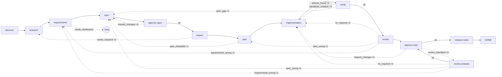

# Workflow и агенты

## Движок (ADR-0004, ADR-0011)

Workflow — YAML-граф шагов. `LocalWorkflowEngine` исполняет его без внешних оркестраторов:

- **Шаги** четырёх видов:
  `deterministic` (зарегистрированный инструмент или возможность: `project.tests`, `standards.check`,
  `artifact.write`, …), `agentic` (агент по id), `approval` (гейт по `artifactType`), `composite`
  (`children` исполняются параллельно с общим бюджетом; первый `SuspendRun` ребёнка паркует весь шаг).
- **Переходы** — чистая функция от исхода: `onSuccess`, `onOutcome: { <outcome>: { to, maxIterations } }`.
  Обратные рёбра объявляются явно; превышение `maxIterations` — `FAILED` с причиной. Исход агента должен
  быть в `outcomes` его контракта.
- **Checkpoint** на каждой границе шага: состояние, итерации, транскрипт агента (каждые
  `checkpointEvery` вызовов инструментов) и, в worktree-режиме, коммит с трейлерами `Jarvis-Run`,
  `Jarvis-Step`, `Jarvis-Kind`.
- **Парковка**: `WAITING_BUDGET` (пул квоты исчерпан; `resumeAfter`), `WAITING_HUMAN` (гейт, тред
  уточнения, неразрешённый эффект, лимит на run/шаг). `jarvis resume` или daemon продолжают с checkpoint.
- **Loop reasons**: при возврате по обратному ребру следующая итерация шага получает причины (нарушения
  стандартов, дефекты, замечания ревью) в слое L2 контекста.

Файлы: встроенные `sdd`, `smoke` (`src/workflows/builtin.ts`); проектные `.jarvis/workflows/<name>.yaml`
переопределяют по имени.

## Граф `sdd`



`verify` — composite из `tests` (агент), `standards` (`standards.check`), `docs` и `telemetry`
(агенты), все параллельно. `needs_clarification` — не ребро, а парковка: AgenticExecutor открывает тред
уточнения, run ждёт человека, после решения тот же шаг исполняется заново с решением в контексте.

| Шаг | Вид | Входы | Выход |
|---|---|---|---|
| discover | deterministic `project.discover` | — | `project-capabilities` |
| research | agent `research` | — | `research` |
| requirements | agent `requirements` | research | `requirements` |
| spec | agent `specification` | research, requirements | `spec` |
| approve-spec | approval `spec` | | |
| impact | agent `impact` | research, spec | `impact` |
| plan | agent `plan` | spec, impact | `plan` |
| implementation | agent `implementation` | spec, plan | `implementation` |
| verify | composite | | |
| tests | agent `test` | spec, implementation | `tests` |
| standards | deterministic `standards.check` | | `standards-check` |
| docs | agent `docs` | spec, implementation | `docs` |
| telemetry | agent `telemetry` | spec, impact, implementation | `telemetry` |
| review | agent `review` | spec, plan, implementation, tests, docs, telemetry | `review` |
| approve-impl | approval `implementation` | | |
| review-analysis | agent `review-analysis` | review-package, spec, requirements, implementation | `review-analysis` |
| release-notes | agent `release-notes` | spec, implementation, review | `release-notes` |

## Агенты (ADR-0001 §6)

`AgentDefinition`: инструкции, роль модели, набор возможностей по принципу наименьших привилегий,
требования к модели (`tools`, `structuredOutput`), контракт результата (zod-схема + допустимые
`outcomes`), лимиты (`maxToolCalls: 40`, `maxModelCalls: 60`, `checkpointEvery: 5`).

| Агент | Роль | Возможности | Исходы |
|---|---|---|---|
| research | research | чтение репо¹, `jira.*`, `confluence.*` | ok |
| requirements | research | чтение репо, `jira.*`, `confluence.*` | ok, needs_clarification |
| specification | research | `repo.read/list/search` | ok |
| impact | research | чтение репо (в т.ч. `graph.impact`, `graph.neighbors`) | ok, needs_research |
| plan | research | `repo.read/list/search` | ok, spec_infeasible |
| implementation | implementation | чтение + `repo.write/edit`, `project.*` | ok |
| test | implementation | чтение + запись, `project.*` | ok, defects_found |
| docs | implementation | чтение + запись | ok |
| telemetry | implementation | чтение + запись | ok, spec_gap |
| review | review | чтение, `project.*` | ok, fix_required, plan_wrong |
| review-analysis | review | чтение, `knowledge.read` | ok, fix_required, spec_wrong, requirements_wrong, needs_clarification |
| release-notes | research | чтение | ok |

¹ чтение репо = `repo.read|list|search`, `git.log|diff|status`, `knowledge.read|search`,
`graph.impact|neighbors`. Ни один агент не получает эффекты на внешние системы (комментарии, PR):
их выполняют детерминированные шаги через журнал эффектов.

Результат агента — JSON-артефакт по схеме; при невалидном ответе — ограниченный ремонт, затем артефакт
`invalid-output` и failure шага. Поле `outcome` результата управляет переходом.

### Контекст агента

Контекст собирается слоями (`src/agents/context.ts`, ADR-0013):

| Слой | Содержимое | Свойство |
|---|---|---|
| L0 | система, политика безопасности, список инструментов | байт-в-байт одинаков для всех вызовов шага → prefix cache |
| L1 | задача, инструкции агента, контракт результата | |
| L2 | текущее состояние: шаг, итерация, loop reasons, принятые уточнения | |
| L3 | входные артефакты | укладывается в бюджет вместе с L4 |
| L4 | EngineeringContextPackage: навыки > стандарты > знание | справедливое деление бюджета; остальное «по запросу» через `knowledge.read` |
| L5 | история вызовов инструментов | растёт в пределах `limits`; по порогам давления (ADR-0013) старые результаты обрезаются до начала и ссылки на блоб, старые блоки сворачиваются в handoff |

Ссылки пакета (какие навыки/стандарты/документы агент видел) попадают в provenance артефакта результата.

### Давление контекста (ADR-0013)

Перед каждым обращением к модели измеряется доля эффективного окна — `min(contextWindow, context.maxContext)`
минус резерв под вывод и 5% окна. Уровень определяют `context.thresholds` (по умолчанию 0,40 / 0,60 /
0,75 / 0,85; фаза > модель > по умолчанию):

| Уровень | Что делает цикл агента |
|---|---|
| healthy | ничего |
| watch | старые результаты инструментов заменяются началом и ссылкой `blob:<ref>` (читается `knowledge.read`) |
| compact | trimming, затем старые блоки сворачиваются в один handoff до `compactTarget` (35%) |
| aggressive | то же с меньшим хвостом и пересобранной с бюджетом ×0,6 базой L3/L4 (раз за шаг) |
| reset | handoff вместо всей истории, не больше двух раз за шаг |

Суммаризирует роль `compaction`, а без неё — модель агента. Оригинал сжатой части лежит блобом, ссылки
`Originals:` накапливаются в handoff; пары вызов/результат инструмента не разрываются. Сбой суммаризатора —
жёсткий trimming и событие `context.compaction_failed`, run продолжается; исчерпание квоты и ошибки
авторизации паркуют run как обычно. Вручную — `jarvis context`, `jarvis compact`, `jarvis reset-context`
([cli.md](cli.md#контекст-агента)).

### Переопределение

- Инструкции: `.jarvis/agents/<id>.md` заменяют встроенные целиком (контракт результата и возможности
  остаются).
- Workflow: `.jarvis/workflows/sdd.yaml` заменяет встроенный граф; можно убрать шаги (`docs`,
  `telemetry`), добавить детерминированные (`project.lint` после `implementation`), изменить
  `maxIterations`.
- Гейты: `human.gates.<type>.required: false` проходит гейт молча (`approval.skipped`).

Пример собственного workflow:

```yaml
name: hotfix
version: 1
entry: discover
steps:
  - id: discover
    kind: deterministic
    tool: project.discover
    outputs: [project-capabilities]
    transitions: { onSuccess: implementation }
  - id: implementation
    kind: agentic
    agent: implementation
    outputs: [implementation]
    transitions: { onSuccess: tests }
  - id: tests
    kind: deterministic
    tool: project.tests
    transitions: { onSuccess: approve-impl }
  - id: approve-impl
    kind: approval
    artifactType: implementation
    transitions:
      onSuccess: DONE
      onOutcome:
        request_changes: { to: implementation, maxIterations: 2 }
```

`jarvis work HOTFIX-7 --workflow hotfix`.

## События

Каждое действие — строка в `events` с `runId`, `stepId`, `iteration`, `payload`:
`run.created|steal|cancel|applied|imported|gc`, `model.call|retry|error`, `tool.call|denied`,
`effect.done|failed|verified|replayed|unresolved`, `approval.recorded|skipped|committed`,
`interaction.opened|turn|resolved|rejected`, `review.submitted|classified|resolved`,
`standards.checked`, `retrieval.knowledge`, `graph.update`, `security.redaction`,
`context.pressure|trimmed|compacted|reset|tightened|compaction_failed|overflow`, `prepush.checked`,
`mcp.discovered|unavailable`, `daemon.tick`. `jarvis status <run> --events n` показывает последние.
Внешнего экспорта событий пока нет: схема `telemetry.export` и проверка egress есть, экспортёра — нет.
