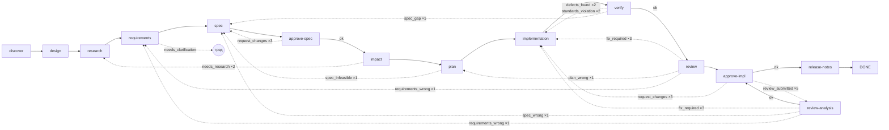

# Workflow и агенты

## Движок (ADR-0004, ADR-0011)

Workflow — YAML-граф шагов. `LocalWorkflowEngine` исполняет его без внешних оркестраторов:

- **Шаги** четырёх видов:
  `deterministic` (зарегистрированный инструмент или возможность: `project.tests`, `standards.check`,
  `artifact.write`, …), `agentic` (агент по id), `approval` (гейт по `artifactType`), `composite`
  (`children` исполняются параллельно с общим бюджетом; первый `SuspendRun` ребёнка паркует весь шаг).
- **Переходы** — чистая функция от исхода: `onSuccess`, `onOutcome: { <outcome>: { to, maxIterations } }`.
  Обратные рёбра объявляются явно; превышение `maxIterations` — `FAILED` с причиной. Исход агента должен
  быть в `outcomes` его контракта.
- **Checkpoint** на каждой границе шага: состояние, итерации, транскрипт агента (каждые
  `checkpointEvery` вызовов инструментов) и, в worktree-режиме, коммит с трейлерами `Jarvis-Run`,
  `Jarvis-Step`, `Jarvis-Kind`.
- **Парковка**:
  - `WAITING_BUDGET` — пул квоты заполнен (ни у одной модели роли нет места) или модель не отвечает;
    `resumeAfter`;
  - `WAITING_HUMAN` — гейт, тред уточнения, неразрешённый эффект, лимит на run/шаг, лимит агента при
    `onLimit: ask`.

  `jarvis resume`, `jarvis continue`, daemon или страница `jarvis ui` продолжают с checkpoint.
- **Loop reasons**: при возврате по обратному ребру следующая итерация шага получает причины (нарушения
  стандартов, дефекты, замечания ревью) в слое L2 контекста.

Встроенные workflow (`src/workflows/builtin.ts`); проектные `.jarvis/workflows/<name>.yaml` переопределяют по
имени:

| Workflow | Команда | Шаги |
|---|---|---|
| `sdd` | `jarvis work` | полный путь, граф ниже |
| `fix` | `jarvis fix` | discover → sources → research → spec → approve-spec → implementation → verify → review → approve-impl |
| `spec` | `jarvis spec` | discover → sources → research → requirements → spec → approve-spec; одобренная spec продолжается в `sdd` (`next:`) |
| `research` | `jarvis research` | discover → sources → research; продолжается в `sdd` (`next:`) |
| `onboard-module` | `jarvis onboard --module` | map (агент `onboard-mapper`) → verify (`onboard.verify`: утверждения сверяются с кодом, выжившее — `candidate`) |
| `ask` | `jarvis ask` | answer (агент `knowledge-answerer`) |
| `review-diff` | `jarvis prepush` | review (семантическое ревью диапазона) |
| `smoke` | — | проверка самого движка |

## Граф `sdd`



`verify` — composite из `tests` (агент), `standards` (`standards.check`), `checks` (`project.checks`: команды
`tools.local` для изменённых пакетов), `docs` и `telemetry` (агенты), все параллельно. `needs_clarification` — не ребро, а парковка: AgenticExecutor открывает тред
уточнения, run ждёт человека, после решения тот же шаг исполняется заново с решением в контексте.

| Шаг | Вид | Входы | Выход |
|---|---|---|---|
| discover | deterministic `project.discover` | — | `project-capabilities` |
| sources | deterministic `sources.collect` (прежнее имя `design.collect` работает) | — | `sources` (задача, её страницы, места их имён и текстов в коде, сверка методов API с `contracts`), `design` (если есть фреймы) |
| research | agent `research` | sources, design | `research` |
| requirements | agent `requirements` | sources, research, design | `requirements` |
| spec | agent `specification` | research, requirements, design | `spec` |
| approve-spec | approval `spec` | | |
| impact | `impact.quick`, иначе agent `impact` | research, spec | `impact` |
| plan | agent `plan` | spec, impact | `plan` |
| implementation | agent `implementation` | spec, plan, design | `implementation` |
| verify | composite | | |
| tests | agent `test` | spec, implementation | `tests` |
| standards | deterministic `standards.check` | | `standards-check` |
| checks | deterministic `project.checks` | | `checks` |
| docs | agent `docs` | spec, implementation | `docs` |
| telemetry | agent `telemetry` | spec, impact, implementation | `telemetry` |
| review | agent `review` | spec, plan, implementation, tests, docs, telemetry | `review` |
| approve-impl | approval `implementation` | | |
| review-analysis | agent `review-analysis` | review-package, spec, requirements, implementation | `review-analysis` |
| release-notes | agent `release-notes` | spec, implementation, review | `release-notes` |

`quick: <tool>` у агентного шага — детерминированный инструмент, который пробуется первым. Если он дал
результат, агента не спрашивают; если ответил `needs_agent`, шаг делает агент как обычно (событие `step.quick`
с причиной, строка шага — `impact.quick, no model call`). У `impact` это `impact.quick`. Он берёт файлы кода,
которые называет одобренная spec, их зависимых из графа проекта (до двух уровней) и покрывающие их тесты, и
пишет тот же документ `impact`. Агенту остаётся случай, когда spec не называет ни одного файла кода или
называет больше двух, когда зависимых больше 15, когда графа для стека нет или когда в spec есть телеметрия,
метрики, события или документация: что из них затронуто, решает агент. Для правки в одну строку impact
раньше был ещё одним вызовом модели (на пилоте — до пяти минут).

## Агенты (ADR-0001 §6)

`AgentDefinition`: инструкции, роль модели, набор возможностей по принципу наименьших привилегий,
требования к модели (`tools`, `structuredOutput`), контракт результата (zod-схема + допустимые
`outcomes`), лимиты (`maxToolCalls: 40`, `maxModelCalls: 60`, `checkpointEvery: 5`).

| Агент | Роль | Возможности | Исходы |
|---|---|---|---|
| research | research | чтение репо¹, `jira.*`, `confluence.*`, `figma.get` | ok |
| requirements | research | чтение репо, `jira.*`, `confluence.*`, `figma.get` | ok, needs_clarification |
| specification | research | `repo.read/list/search` | ok |
| impact | research | чтение репо (в т.ч. `graph.impact`, `graph.neighbors`) | ok, needs_research |
| plan | research | `repo.read/list/search` | ok, spec_infeasible |
| implementation | implementation | чтение + `repo.write/edit`, `project.*`, `figma.get` | ok |
| test | implementation | чтение + запись, `project.*` | ok, defects_found |
| docs | implementation | чтение + запись | ok |
| telemetry | implementation | чтение + запись | ok, spec_gap |
| review | review | чтение, `project.*` | ok, fix_required, plan_wrong |
| review-analysis | review | чтение, `knowledge.read` | ok, fix_required, spec_wrong, requirements_wrong, needs_clarification |
| release-notes | research | чтение | ok |
| onboard-mapper | research | чтение | ok |
| knowledge-answerer | research | `knowledge.read`, `knowledge.search` | ok |

¹ чтение репо = `repo.read|list|search`, `git.log|diff|status`, `knowledge.read|search`,
`graph.impact|neighbors`. Ни один агент не получает эффекты на внешние системы (комментарии, PR):
их выполняют детерминированные шаги через журнал эффектов.

Результат research несёт `contradictions` — противоречия в требованиях (между источниками, внутри одного правила,
с макетом; с кодом — только если он показывает, что требование невыполнимо) с обеими сторонами, источниками и вопросом аналитику; requirements каждое закрывает
источником или считает блокирующим. Число противоречий есть в `agent.finish` и в строке шага. Требования других
систем research кладёт в `dependencies` (что репозиторий от них ждёт), а у противоречия указывает `owner` — кому
вопрос.

Результат агента — JSON-артефакт по схеме; при невалидном ответе — ограниченный ремонт, затем артефакт
`invalid-output` и failure шага. Поле `outcome` результата управляет переходом.

### Контекст агента

Контекст собирается слоями (`src/agents/context.ts`, ADR-0013):

| Слой | Содержимое | Свойство |
|---|---|---|
| L0 | система, политика безопасности, список инструментов | байт-в-байт одинаков для всех вызовов шага → prefix cache |
| L1 | задача, инструкции агента, контракт результата | |
| L2 | текущее состояние: шаг, итерация, loop reasons, принятые уточнения | |
| L3 | входные артефакты | укладывается в бюджет вместе с L4 |
| L4 | EngineeringContextPackage: навыки > стандарты > знание | справедливое деление бюджета; остальное «по запросу» через `knowledge.read` |
| L5 | история вызовов инструментов | растёт в пределах `limits`; по порогам давления (ADR-0013) старые результаты обрезаются до начала и ссылки на блоб, старые блоки сворачиваются в handoff |

Ссылки пакета (какие навыки/стандарты/документы агент видел) попадают в provenance артефакта результата.

**Конец цикла — `DONE`.** Собрав нужное, агент отвечает одной строкой `DONE` (и, если есть, что осталось
неизвестным), без документа; сразу за этим Jarvis просит итоговый документ — в JSON-режиме, с этой строкой в
разговоре. Готовый документ прямо в цикле тоже принимается, как раньше. В `agent.finish` — `endedWith`: `done`,
`document`, `text`, `empty` (ответ пустой: лимит вывода ушёл на рассуждения) или `limit` (цикл остановлен лимитом).
В пилоте модель с рассуждениями в последнем ходе «писала документ в голове», тратила весь лимит вывода (16k) и
отвечала ничем — 143 с впустую в трёх ранах из четырёх, после чего документ всё равно запрашивался отдельно.

**Вызовы пачкой.** Правило системного слоя: независимые чтения, поиски и листинги агент просит в одном ходе
параллельными вызовами (до 8), по одному — только когда следующий зависит от результата. Время рана почти целиком —
ожидание модели, а каждый её вызов заново отправляет весь промпт: в пилоте 44 из 58 вызовов просили по два
инструмента. Отдельного «прочитать несколько файлов» нет: защита от повторного чтения и закрепление работают по
одному файлу на вызов.

Вызовы одного ответа runner выполняет так: чтения без эффектов (`access: read`, без `effect`) — одновременно, до 6
сразу; запись, команды и всё с эффектом — по одному и по порядку. Ответы уходят модели в том порядке, в каком она
просила. В журнале — событие `tool.batch` (номер вызова модели, сколько, параллельно ли, что просили), у каждого
`tool.call` пачки — `batch` и `slot`. В `jarvis ui` пачка видна в карточке Now дорожками на одной шкале времени (что
идёт, что держит пачку; после неё — «the last batch»), в ленте Activity — одной строкой с вызовами под ней, а в строке
шага — `⇉ N per call`: сколько инструментов в среднем на вызов модели. В терминале — `⇉N` в строке последних
вызовов.

### Давление контекста (ADR-0013)

Перед каждым обращением к модели измеряется доля эффективного окна — `min(contextWindow, context.maxContext)`
минус резерв под вывод и 5% окна. Уровень определяют `context.thresholds` (по умолчанию 0,40 / 0,60 /
0,75 / 0,85; фаза > модель > по умолчанию):

| Уровень | Что делает цикл агента |
|---|---|
| healthy | ничего |
| watch | старые результаты инструментов заменяются началом и ссылкой `blob:<ref>` (читается `knowledge.read`) — не все, а пока промпт не вернётся к ¾ порога watch (0.40 → 0.30): сначала поиски и листинги (`*.search`, `*.list`, `git.log`), потом самые старые; три последних результата, источники задачи — ответы `jira.*`, `confluence.*`, `figma.*` — и закреплённые файлы остаются целиком |
| compact | trimming (источники задачи всё ещё целиком), затем старые блоки сворачиваются в один handoff до `compactTarget` (35%) |
| aggressive | то же с меньшим хвостом и пересобранной с бюджетом ×0,6 базой L3/L4 (раз за шаг) |
| reset | handoff вместо всей истории, не больше двух раз за шаг |

**Повторное чтение файла.** Агент читает тот же файл (те же строки) ещё раз в том же шаге:
- файл не менялся, и его текст ещё в разговоре — короткий ответ «уже читал, текст выше, в результате вызова N»
  вместо текста;
- первый результат с тех пор обрезан или свёрнут — текст снова, и этот результат закрепляется: на уровнях watch и
  compact его не обрезают (aggressive, reset и компакция всё ещё могут);
- файл изменился — новый текст с пометкой.

Вызов инструмента засчитывается в лимит как обычно; событие `tool.reread`. Что агент уже читал, восстанавливается
из самого разговора, поэтому продолженный шаг это помнит. В пилоте один файл за шаг прочитали 62 раза: результат
обрезался через пару вызовов, и агент читал файл снова.

Суммаризирует роль `compaction`, а без неё — модель агента; на сводку до 8000 токенов вывода, потому что
рассуждающая модель тратит на размышления ту же квоту (в пилоте при 2000 одна сводка пришла пустой, следующая
оборвалась на полуслове). Пустая сводка историю ничем не заменяет: в handoff идут прежний handoff, запись вызовов
(инструмент, аргументы, где лежит результат) и источники задачи как прочитаны. Обрезанная сводка дополняется той
же записью вызовов. В событии `context.compacted` в этих случаях есть `fallback: empty|truncated`. Оригинал
сжатой части лежит блобом, ссылки `Originals:` накапливаются в handoff; пары вызов/результат инструмента не
разрываются. Сбой суммаризатора —
жёсткий trimming и событие `context.compaction_failed`, run продолжается; исчерпание квоты и ошибки
авторизации паркуют run как обычно. Вручную — `jarvis context`, `jarvis compact`, `jarvis reset-context`
([cli.md](cli.md#jarvis-context-run)).

### Переопределение

- Инструкции: `.jarvis/agents/<id>.md` заменяют встроенные целиком (контракт результата и возможности
  остаются).
- Workflow: `.jarvis/workflows/sdd.yaml` заменяет встроенный граф; можно убрать шаги (`docs`,
  `telemetry`), добавить детерминированные (`project.lint` после `implementation`), изменить
  `maxIterations`.
- Гейты: `human.gates.<type>.required: false` проходит гейт молча (`approval.skipped`).

Пример собственного workflow:

```yaml
name: hotfix
version: 1
entry: discover
steps:
  - id: discover
    kind: deterministic
    tool: project.discover
    outputs: [project-capabilities]
    transitions: { onSuccess: implementation }
  - id: implementation
    kind: agentic
    agent: implementation
    outputs: [implementation]
    transitions: { onSuccess: tests }
  - id: tests
    kind: deterministic
    tool: project.tests
    transitions: { onSuccess: approve-impl }
  - id: approve-impl
    kind: approval
    artifactType: implementation
    transitions:
      onSuccess: DONE
      onOutcome:
        request_changes: { to: implementation, maxIterations: 2 }
```

`jarvis work HOTFIX-7 --workflow hotfix`.

## События

Каждое действие — строка в `events` с `runId`, `stepId`, `iteration`, `payload`:
- прогон: `run.created|state|lease|leaseLost|steal|recovered|interrupted|cancel|applied|imported|gc`;
  `run.driver` (прогон ведёт страница `jarvis ui`: начат там или подхвачен, `adopted`), `run.resumedBy`
  (страница запустила `jarvis resume`);
- шаги: `step.start|finish|next|quick|error`, `workflow.loop|loopExhausted`, `loop.rerun` (повтор шага
  исчерпанной петли: `r` на карточке, кнопка `jarvis ui`);
- агент: `agent.start` (лимиты, выданное человеком, провенанс пакета знаний) `|finish|limit`;
- модель: `model.call|progress|retry|error`, `model.failover` (вызов ушёл следующей модели роли: пул первой полон);
- бюджет: `budget.grant` (человек добавил или сказал «закончить»);
- инструменты и эффекты: `tool.call|denied`, `tool.reread` (файл прочитан в шаге ещё раз: `unchanged`, `again`, `changed`), `effect.done|failed|verified|replayed|unresolved`;
- люди: `approval.recorded|skipped|committed` (у `recorded` — `channel`: `cli` или `ui`), `card.open|closed`
  (карточка в терминале ждёт решения: так страница знает, пойдёт ли прогон дальше сразу),
  `interaction.opened|turn|resolved|rejected`, `review.submitted|classified|resolved|markersRemoved`,
  `workspace.humanEdit|scratchRemoved`;
- знание и контекст: `knowledge.promoted`, `standards.checked`, `retrieval.knowledge`,
  `graph.update|update_failed`, `context.pressure|trimmed|compacting|compacted|reset|tightened|compaction_failed|overflow|prefixChanged`
  (`compacting` — началась сводка старой части разговора: отдельный вызов модели);
- прочее: `security.redaction|pathDenied`, `prepush.checked`, `mcp.discovered|unavailable`, `daemon.tick`.

`jarvis status <run> --events n` показывает последние.
Внешнего экспорта событий пока нет: схема `telemetry.export` и проверка egress есть, экспортёра — нет.

Кроме журнала в базе есть `step.error` (необработанное исключение шага: сообщение и стек, урезанные), у `model.error` и
`model.retry` — `message` (начало ответа провайдера), у `tool.call` — `args` (редактированные, до 600 символов).

## Технический лог

Журнал событий — это счётчики и исходы; чтобы разбирать, а не гадать, рядом пишется технический лог:
NDJSON-файлы `~/.jarvis/logs/jarvis-YYYY-MM-DD.ndjson` (каталог — `JARVIS_LOG_DIR`), по одному на день, файлы старше
`JARVIS_LOG_KEEP_DAYS` (14) удаляются. Одна строка — одна запись: `ts`, `level`, `event`, `runId`/`stepId`/`iteration`
и поля. Любая строка проходит редактор секретов (ADR-0010), длинные значения режутся на `JARVIS_LOG_MAX_FIELD`
(20000) символах, запись лога никогда не ломает run.

Уровень задаёт `JARVIS_LOG`:

| Уровень | Что пишется |
|---|---|
| `off` | ничего |
| `error` | отказы: `model.error` (с сообщением провайдера), `model.error.detail` (стек и причина), `step.error` и `step.error.detail`, `tool.denied`, `cli.crash`, `*_failed`, `context.overflow` |
| `info` (по умолчанию) | то же и **каждое событие журнала** (зеркало), плюс `cli.invoke` (аргументы, cwd) и `cli.exit` (код, миллисекунды): падение процесса видно даже тогда, когда до базы оно не дошло |
| `debug` | то же и тела: `model.request` — промпт **дельтой** (первый вызов шага целиком, дальше только новые сообщения; `messagesFrom` — откуда дельта, `rewrittenEarlier` — сколько прежних сообщений изменила компакция), `model.response` (текст, вызовы инструментов, usage, latency), `tool.result` (аргументы и результат) |

`debug` содержит код и промпты проекта: лог лежит на той же машине, что база и артефакты, но не включай его в
общих средах без надобности. Читает лог `jarvis logs` ([cli.md](cli.md#jarvis-logs-run---level-errorinfodebug---event-text---tail-n---since-age---full---path--f)),
`jarvis doctor` показывает уровень, каталог и размер.
